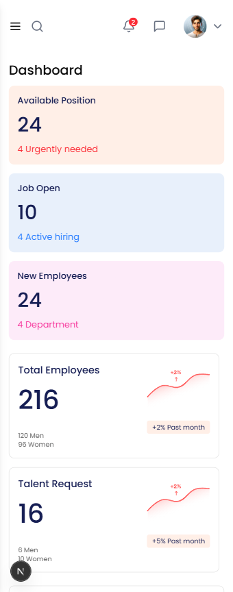

# WeHR - Modern HR Management Dashboard

WeHR is a modern, responsive HR management dashboard built with Next.js, Tailwind CSS, and TypeScript. It provides a clean and intuitive interface for managing HR-related tasks, employee data, and recruitment processes.

## Features

- 📱 Fully Responsive Design (Mobile, Tablet, Desktop)
- 🎨 Modern and Clean UI
- 📊 Interactive Dashboard with Stats
- 👥 Employee Management
- 📅 Schedule Management
- 📢 Announcements System
- 🔍 Smart Search Functionality
- 🌓 Collapsible Sidebar
- 📱 Mobile-First Approach

## Tech Stack

- [Next.js](https://nextjs.org/) - React Framework
- [TypeScript](https://www.typescriptlang.org/) - Programming Language
- [Tailwind CSS](https://tailwindcss.com/) - CSS Framework
- [Lucide Icons](https://lucide.dev/) - Icon Library
- [Shadcn UI](https://ui.shadcn.com/) - UI Components

## Screenshots

### Desktop View

*Full dashboard view on desktop with expanded sidebar*

### Tablet View

*Tablet view with collapsed sidebar showing only icons*

### Mobile View

*Mobile view with hamburger menu and expandable search*

## Key Components

1. **Dashboard Overview**
   - Quick stats cards
   - Employee statistics
   - Talent request metrics
   - Recent activities

2. **Sidebar Navigation**
   - Collapsible design
   - Icon-only view on tablet
   - Full-width on desktop
   - Mobile-responsive with overlay

3. **Header**
   - Smart search functionality
   - Notification system
   - User profile quick access
   - Mobile-optimized layout

4. **Content Sections**
   - Announcements feed
   - Upcoming schedules
   - Priority tasks
   - Department statistics

## Getting Started

1. Clone the repository:
```bash
git clone https://github.com/yourusername/wehr-dashboard.git
```

2. Install dependencies:
```bash
cd wehr-dashboard
npm install
```

3. Run the development server:
```bash
npm run dev
```

4. Open [http://localhost:3000](http://localhost:3000) in your browser.

## Project Structure

```
wehr-dashboard/
├── src/
│   ├── components/     # Reusable UI components
│   ├── app/           # Next.js app directory
│   ├── styles/        # Global styles
│   └── types/         # TypeScript type definitions
├── public/            # Static assets
└── package.json       # Project dependencies
```

## Acknowledgments

- Design inspiration from modern HR management systems
- Icons provided by Lucide Icons
- UI components from Shadcn UI
